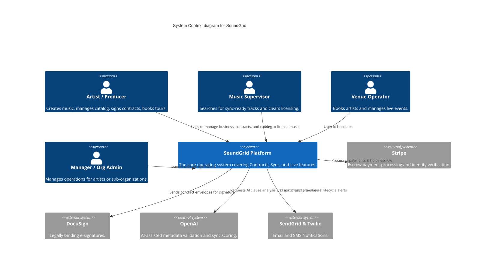
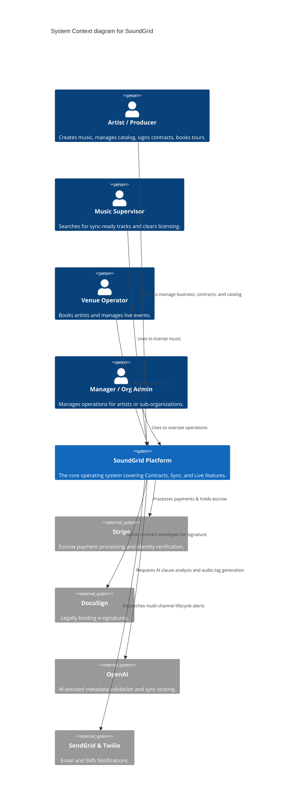
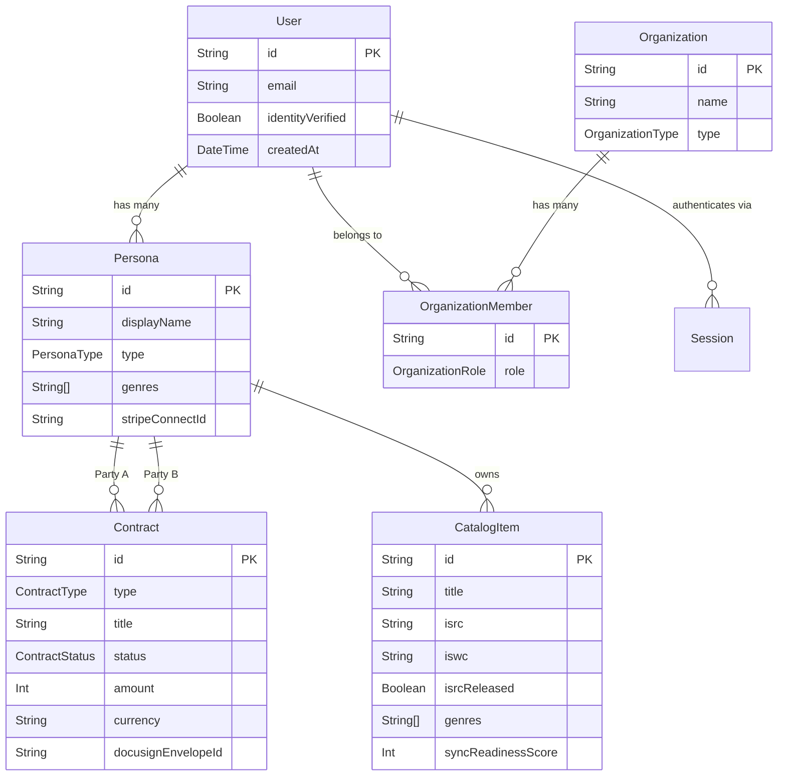

# SoundGrid 🎛️
**SoundGrid** is the commercial operating layer for independent music professionals. It provides a unified platform where artists, producers, music supervisors, and venue operators can contract, license, book, and get paid without friction, delay, or exploitation.
By automating unenforceable verbal agreements and streamlining metadata clearance, SoundGrid ensures professionals get paid on time while protecting their creative IP.
---
## 🌟 Core Pillars
SoundGrid is composed of three integrated product pillars designed to support the complete lifecycle of independent music commerce:
### 1. ContractGrid (Contracts & Payments)
- **AI-Assisted Contracting:** Guided wizard for 8 core music agreement types (Producer, Split Sheet, Sync License, Performance, etc.).
- **Escrow-Backed Payments:** Secure Stripe Treasury/Connect integration holding funds until milestones or signatures are completed.
- **E-Signature:** Integrated DocuSign workflow for legally binding agreements.
- **Distribution Gate:** Prevents distribution (unlocking ISRC/ISWC) until agreements and split sheets are fully executed.
### 2. SyncGrid (Sync Licensing)
- **Marketplace:** Artist-facing catalog submission and supervisor-facing discovery portal.
- **AI Metadata Verification:** "Aigency" AI Agent for deep metadata validation and Sync-Readiness scoring.
- **Clearance Workflow:** End-to-end custom license generation and multi-territory compliance checking.
### 3. LiveGrid (Live Music & Touring)
- **Tour Routing:** Geographic and availability-based tour optimization matching.
- **Venue Discovery:** Booking marketplace with standardized performance agreements.
- **Escrow Bookings:** Automated, secure payouts protecting both the artist and the venue.
---
## 🏛️ System Architecture
SoundGrid is currently operating as a **Modular Monolith** with clear service module boundaries, built for an eventual microservices transition.
### C4 System Context Diagram



---
## 🗄️ Database Schema (Core)
Below is the Entity-Relationship Diagram (ERD) summarizing the core domains: Multi-persona Authentication, Legal Contracts, and Catalog Management.



---
## 💻 Technology Stack
- **Frontend Application:** React SPA + Next.js SSR (Vanilla CSS for highly flexible, high-authority aesthetics).
- **Backend Services:** Node.js (TypeScript) / Express.js / Fastify.
- **Database / ORM:** PostgreSQL 16 managed via Prisma ORM.
- **Caching:** Redis.
- **Storage:** AWS S3 (Documents, Audio processing) + CloudFront CDN.
- **Audio Processing Pipeline:** Python 3.12 (FastAPI), FFmpeg, librosa.
- **Search Infrastructure:** AWS OpenSearch (Elasticsearch-compatible).
- **Event Bus:** AWS SQS / SNS for cross-service events.
---
## 🚀 Development Setup
### Prerequisites
- Node.js (v20+)
- `pnpm` (Project preferred package manager)
- PostgreSQL (v16+)
- Redis
### Getting Started
1. **Clone the repository:**
   ```bash
   git clone <repository-url>
   cd soundgrid
   ```
2. **Install dependencies:**
   *(SoundGrid uses a monorepo setup, please use `pnpm` at the root)*
   ```bash
   pnpm install
   ```
3. **Environment Setup:**
   Copy `.env.example` to `.env` in the respective package layers and fill in the required environment variables (Database URL, Stripe Keys, DocuSign Keys).
   ```bash
   cp .env.example .env
   ```
4. **Database Configuration:**
   Navigate to the database package and align your Prisma schema:
   ```bash
   cd packages/database
   pnpm prisma generate
   pnpm prisma db push
   ```
5. **Run the Application:**
   From the root of the project:
   ```bash
   pnpm dev
   ```
---
## 📚 Documentation Reference
For deeper insights into the project, please reference the internal documentation:
- [Strategic Project Brief](./docs/soundgrid-strategic-project-brief.md)
- [System Architecture](./docs/soundgrid-system-architecture.md)
- [Frontend Architecture](./docs/soundgrid-frontend-architecture.md)
- [Roadmap & Planning](./.planning/ROADMAP.md)
Screens and HTML Mockups can be found under `./site/public` and `./queue`.
